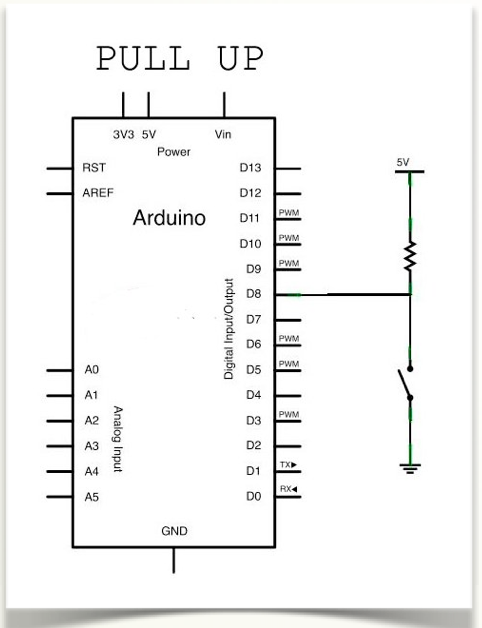
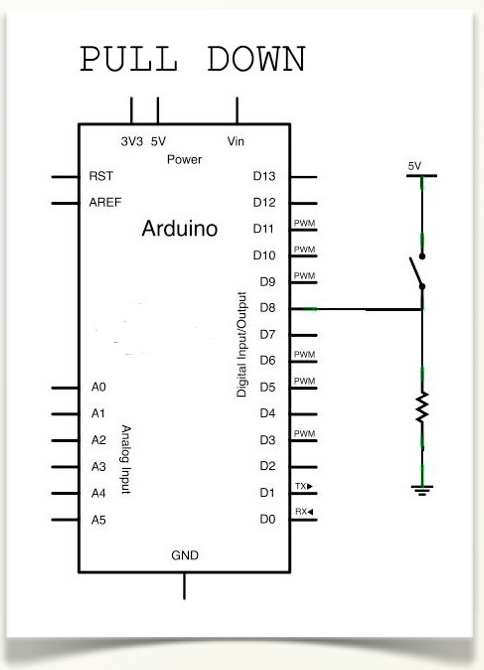
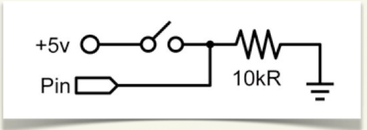

# 2.2.3 Pull-up y pull-down

En los proyectos con dispositivos digitales, caso de la placa Arduino, reciben señales de entradas digitales del exterior. Estas señales externas sirven para activar o desactivar un circuito, recibir información del estado de un sensor,...

Las resistencias “pull-up” y “pull-down” son resistencias que se ponen en las entradas digitales para fijar un valor por defecto, nivel alto \(“1”\) o nivel bajo \(“0”\), cuando no se detecta ningún valor. Esto ocurre cuando la entrada no está conectada a nada.

En el caso de tener que conectar un interruptor a una entrada digital de Arduino necesitamos hacerlo a través de una resistencia de este tipo. Veamos un ejemplo:

 

La resistencia **“pull-up”** establece un nivel alto \(1\) en la entrada digital en el estado de reposo del circuito. Un circuito con una entrada “pull-up” sería el siguiente.

La resistencia **“pull-down”** establece un nivel bajo \(0\) en la entrada digital en el estado de reposo del circuito. Este tipo de circuito es el más empleado en las entradas digitales para evitar lecturas erróneas debido a ruidos externos y consumo de energía. La resistencia suele ser de 10 kΩ y el circuito con esta configuración sería el siguiente.

Un ejemplo de circuito **“pull-down”** lo tenemos en la placa EduBásica en el pin digital D2, preparado para configurarlo como entrada, tiene conectado un pulsador y una resistencia pull-down. El esquema del circuito es el siguiente

 El funcionamiento de este circuito que está conectado al pin digital D2 como entrada es detectar si el pulsador está pulsado o no.

* Si el pulsador no está pulsado en Pin, que está conectado a D2, tenemos 0V por no pasar corriente entre el pin D2 y masa. Por tanto, corresponde a un nivel bajo o “0” lógico.
* Si el pulsador esta pulsado en el pin D2 tenemos 5V, que corresponde a un nivel alto o “1” lógico.
* Si en el anterior circuito no se pone la resistencia de 10KΩ y el pulsador está abierto con el propósito de tener un nivel bajo porque no hay tensión, puede ocurrir y de manera aleatoria que el pin D2 lea un nivel alto por alguna interferencia producida por motores eléctricos, bobinas de un relé u otro dispositivo de nuestro proyecto.

