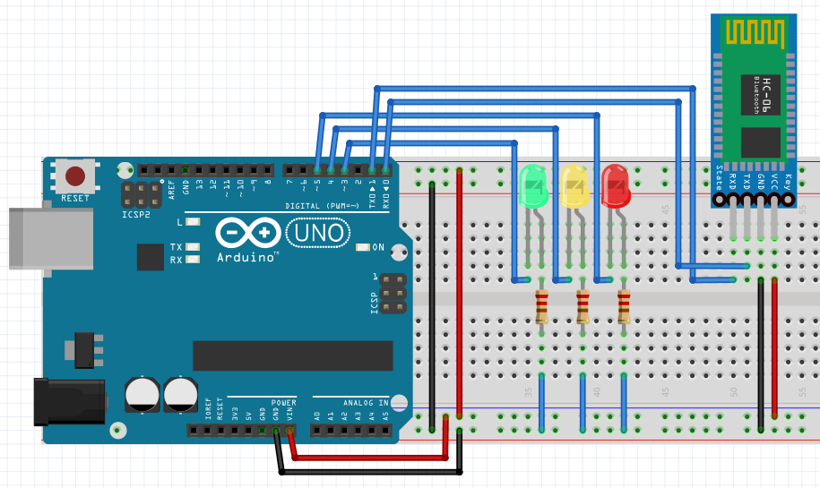

# 4.1.5 M1 Encender LEDs

El objetivo de esta práctica es encender los LEDs de EDUBASICA con el móvil:

* Cuando se pulsa la **flecha arriba**, la APP lanza el dato **U** y tiene que encenderse el led **ROJO.**
* Cuando se pulsa el botón **flecha derecha**, la APP lanza el dato **R**y tiene que encenderse el led **AMARILLO.**
* Cuando se pulsa la **flecha abajo**, la APP lanza el dato **D**y tiene que encenderse el led **VERDE.**
* Cuando se pulsa la **flecha izquierda**, la APP lanza el dato **L**y tienen que apagarse todos.

## SIN EDUBASICA

No pasa nada, con una placa Protoboard pon 3 leds en D3,D4 y D5 y el módulo Bluetooth.



## CON EDUBÁSICA

No hay que hacer nada especial, sólo conectar el módulo Bluetooth

## RESULTADO

> El vídeo está realizado con otra APP ya desfasada, pero sirve igual de ejemplo, es increible, sólo pasó un mes !



## PROGRAMA

Este es el programa que tienes que cargar en el Arduino. Súbelo, empareja tu móvil[ como hemos visto aquí](https://github.com/deleyva/programa-arduino-mediante-codigo/tree/a407da71017a2f6edc4a9de5f70319276906de88/vincular_mvil.html) y conseguirás que **la APP** encienda los leds como en el vídeo.

```text
//PROGRAMA DONDE SE ENCIENDEN LOS LEDS DE EDUBASICA SEGÚN LA APP  ///////////////////
//
// FLECHA ARRIBA -> SE ENCIENDE EL LED ROJO
// FLECHA DERECHA-> SE ENCIENDE EL LED AMARILLO
// FLECHA ABAJO -> SE ENCIENDE EL LED VERDE
// FLECHA IZQUIERDA -> SE APAGAN
//
///////////////////////////////////////////////////////////////////////////////////////////////
int ledArriba = 5; //LED ROJO DE EDUBASICA
int ledDerecha = 4; //LED AMARILLO DE EDUBASICA
int ledAbajo = 3; // LED VERDE DE EDUBASICA
//////////////////////////////////////////////////////////////////////////////////////////////
void setup() {
Serial.begin(9600);
pinMode(ledArriba,OUTPUT);
pinMode(ledAbajo,OUTPUT);
pinMode(ledDerecha,OUTPUT);
}
/////////////////////////////////////////////////////////////////////////////////////////////////////
void loop() {

 if(((Serial.read())==('U'))){
      digitalWrite(ledArriba, HIGH);
      digitalWrite(ledAbajo, LOW);
      digitalWrite(ledDerecha, LOW);
 }
 if(((Serial.read())==('D'))){
      digitalWrite(ledArriba, LOW);
      digitalWrite(ledAbajo, HIGH);
      digitalWrite(ledDerecha, LOW);
 }
 if(((Serial.read())==('R'))){
      digitalWrite(ledArriba, LOW);
      digitalWrite(ledAbajo, LOW);
      digitalWrite(ledDerecha, HIGH);
 }
  if(((Serial.read())==('L'))){
      digitalWrite(ledArriba, LOW);
      digitalWrite(ledAbajo, LOW);
      digitalWrite(ledDerecha, LOW);
 }

 }
```

