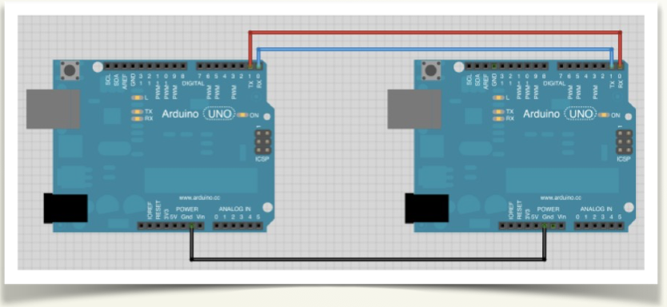

# 4.2.1 M2: dos Arduinos

El proceso es parecido al bluetooth. Aquí queremos que una Arduino envíe \(MAESTRO\) y que otra reciba \(ESCLAVO\), así que cada una correrá un programa distinto.

Podemos hacer también que ambas tarjetas envíen y reciban datos, para ello, la modificación sobre lo que expongo aquí serían muy sencillas, \(básicamente copiar y pegar los trozos de código intercambiados\).

**Conexiones:**

Usaremos los pines estándar de comunicación serie de Arduino:

* 0 : RX \(pin por el que RECIBE los datos serie\)
* 1 : TX \(pin por el que ENVÍA los datos serie\)

Para comunicación en 2 direcciones: los 2 pueden enviar / recibir. Las conexiones TX/RX se intercambian \(lo que uno envía -TX- tiene que entrar en el otro -RX-\). Cualquiera de las 2 puede ser Maestro o Esclavo. **IMPORTANTE**: Conectar ambas GND de las placas.



En el siguiente ejemplo , el maestro, cada 3 segundos envía un carácter al esclavo.

* Si envía una "r", el esclavo hará parpadear su led \(d13\) rápido.
* Si envía una "l", el esclavo hará parpadear su led \(d13\) lento.

El programa para el Arduino MAESTRO es:

```cpp
////////////////////// ARDUINO MAESTRO /////////////////
void setup(){ 
  Serial.begin(9600);
}
void loop()
{ Serial.write("r");
  delay(3000);
  Serial.write("l");
  delay(3000);
}
```

El programa para el Arduino ESCLAVO es:

```cpp
////////////// ARDUINO ESCLAVO /////////
void setup(){ 
  pinMode(13,OUTPUT);
  Serial.begin(9600);
}
void loop(){ 
        char dato= Serial.read();//Guardamos en la variable dato el valor leido
        switch(dato){ //Comprobamos el dato
         case 'r':  //Si recibimos una 'r' ...
          for(int i=0; i<20; i++){
               digitalWrite(13,HIGH);
               delay(80);
               digitalWrite(13,LOW);
               delay(80);
          }
          break;
         case 'l':    //si recibimos una 'l' ...
         for(int i=0; i<10; i++){
               digitalWrite(13,HIGH);
               delay(1000);
               digitalWrite(13,LOW);
               delay(1000);
          }
          break;
          default:
           digitalWrite(13,LOW);
           break;
        }
}
```

## Si no tienes dos ARDUINOS

Puedes hacerlo con una simulación en [https://www.tinkercad.com](https://www.tinkercad.com) en nuestro caso este fue el resultado:

## Si tienes dos ARDUINOS

Pues a disfrutar de tu "Red particular" :

