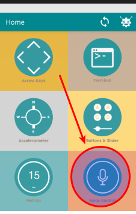
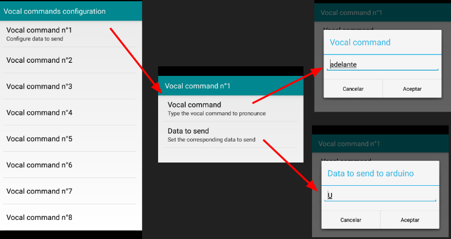

# 5.2.3.5 M8 Coche con voz

## Coche teledirigido con voz

¿Y si ahora lo controlamos por voz?



## Solución

**¡¡ Es el mismo código que** [**6.2.3.4 M7 Coche teledirigido** ](644-m7-coche-teledirigido.md)**!!!**

Lo que pasa es en la aplicación [Arduino Blue Control](../../../4.-comunicaciones/arduino_y_mvil/la_app.md) utilizamos en vez del mando con flechas, el control de voz. [**Easy-peasy**](http://www.wordreference.com/es/translation.asp?tranword=easy-peasy) !!

Y previamente hemos configurado los comandos de voz:

| Orden de voz | Comando a enviar |
| :--- | :--- |
| adelante | U |
| atrás | D |
| derecha | R |
| izquierda | L |
| stop | S |

Total 5 comandos de voz a configurar:

