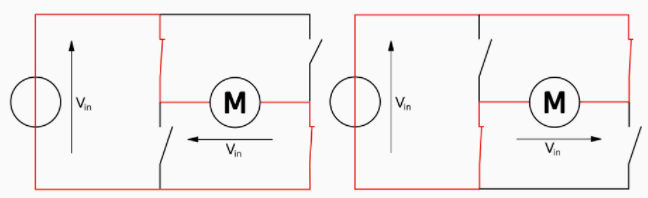

# 5.2.2 Circuito L293

El circuito integrado L293 permite controlar motoresDC de pequeña potencia, pero en general bobinas, o sea cualquier elemento que precise pico de potencia, como los relés, etc.. Para utilizarlo hay que hacer un montaje externo a Arduino, en una placa de pruebas, y alimentar a los motores a través de este circuito integrado.

El CI L293 tiene las siguientes características:

* Se pueden controlar hasta 2 motores.
* Proporciona 1A a los motores \(en total\)  y permite cambiar el sentido de giro.
* Utiliza un puente en H que funciona según se observa en las figuras \(internamente utiliza transistores para conmutar\*\) :

Modos de operación para invertir el sentido de giro:

"[H bridge operating](https://commons.wikimedia.org/wiki/File:H_bridge_operating.svg#/media/File:H_bridge_operating.svg)" by Cyril BUTTAY - own work, made using inkscape. Licensed under [CC BY-SA 3.0](http://creativecommons.org/licenses/by-sa/3.0/) via [Wikimedia Commons](https://github.com/deleyva/programa-arduino-mediante-codigo/tree/a407da71017a2f6edc4a9de5f70319276906de88/commons.wikimedia.org/wiki/README.md).

\*Datasheet: [http://www.me.umn.edu/courses/me2011/arduino/technotes/dcmotors/L293/l293.pdf](http://www.me.umn.edu/courses/me2011/arduino/technotes/dcmotors/L293/l293.pdf)

