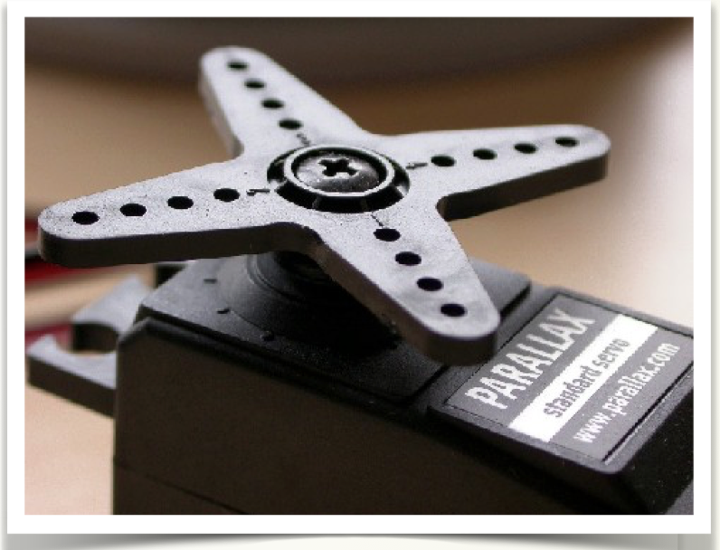

# 5.1 Control de servomotores

## Control de servomotores

Una de las aplicaciones más utilizadas de los sistemas de control por ordenador y en la robótica están asociados con los motores, que permiten accionar o mover otros componentes, como puertas, barreras, válvulas, ruedas, etc. Uno de los tipos que vamos a ver en este capítulo es el servomotor que posee la capacidad de posicionar su eje en un ángulo determinado entre 0 y 180 grados en función de una determinada señal.

### Servos de rotación contínua

Son servos por fuera igual que los anteriores, pero pueden girar 360º y se controlan por tiempo, es decir servoRotCont.write\(90\);

Si quieres saber más sobre servomotores te recomendamos estas paginas del Zaragozano Luis LLamas:

* [Servomotores](https://www.luisllamas.es/controlar-un-servo-con-arduino/) convencionales
* Servomotores de [rotación continua](https://www.luisllamas.es/controlar-un-servo-de-rotacion-continua-con-arduino/)

Recomendamos testear tus servos en el [Montaje 1](https://github.com/deleyva/programa-arduino-mediante-codigo/tree/a407da71017a2f6edc4a9de5f70319276906de88/montaje_1_testea_tu_servo.html).

## Conocimiento previo

* Programación básica de Arduino.
* Uso de librerías internas de Arduino \(Servo.h\).
* Bucles **for.**

## Objetivos

* Conocer qué es un servomotor, tipos y funcionamiento.
* Las aplicaciones en el mundo de la automática y el control por ordenador de este tipo de motores.
* Usar la librería que incorpora Arduino para controlar los servos.

Lista de materiales:

* Servomotor.
* Placa Arduino UNO.
* Placa EduBásica \(opcional\).

