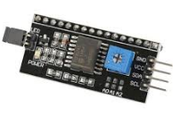
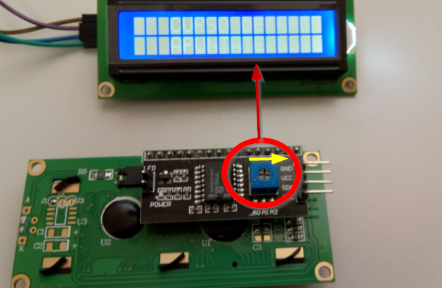
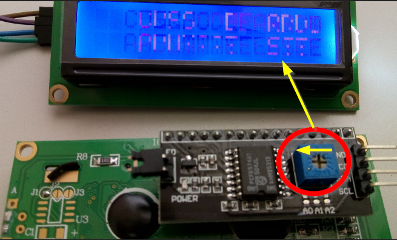

# 3.5.2 I2C

Como hemos dicho en [La pantalla LCD](https://github.com/deleyva/programa-arduino-mediante-codigo/tree/a407da71017a2f6edc4a9de5f70319276906de88/3-lcd/3-lcd/31-la-pantalla.md) no es recomendable su conexión directa con Arduino, para ello está este controlador que permite su conexión **utilizando sólo dos cables**. Los dos componentes pueden salir por menos de 5€.

Su conexión con el LCD tiene que ser tal y com indica la imagen, y soldándo los terminales con cuidado:  _CC-BY-SA_ [_Luis Llamas_](https://www.luisllamas.es/arduino-lcd-i2c/)

## Conexión con el Arduino

La conexión tiene serie tiene que ser en los pines A4 y A5 exclusivamente en el Arduino Uno pues son los dedicados para el protocolo serie I2C que veremos más adelante. Para otras placas ve[r la página de Luis Llamas](https://www.luisllamas.es/arduino-lcd-i2c/).

El esquema es muy sencillo:

  _CC-BY-SA_ [_Luis Llamas_](https://www.luisllamas.es/arduino-lcd-i2c/)

## Contraste

Tiene un potenciómetro azul para regular el contraste, bastante sensible por cierto \(una poca variación hace que nuestro texto no se vea correctamente\):

