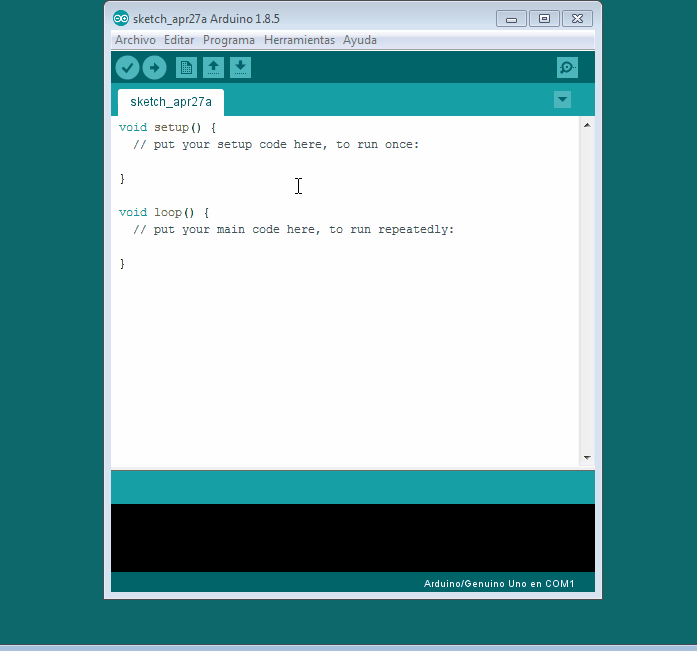

# 3.5.4 Librería LiquidCrystal\_I2C

Sólo nos falta incorporar la librería LiquidCrystal\_I2C que te [lo puedes descargar aquí](https://codeload.github.com/marcoschwartz/LiquidCrystal_I2C/zip/master)

Una vez descargado, es un fichero comprimido .zip o .rar **no lo descomprimas** diréctamente desde el menú del entorno de programación lo incorporas de esta manera :

## Principales funciones

**LiquidCrystal\_I2C\(lcd\_Addr, lcd\_cols, lcd\_rows\)** Crea una variable \(informáticamente un objeto de la clase LiquidCrystal\_I2C\) para poder utilizar sus funciones, hay que indicar entre paréntesis la dirección, columnas y filas indicadas. Por ejemplo LiquidCrystal\_I2C lcd\(0x3F,16,2\);

_¿No sabes la dirección?. Eso es que te has saltado_ [_esta lección_](313-escaneo.md) en mi caso es 0x3F.

Después de crear esa variable hay que inicializarlo con lcd.**init\(\)**

> lcd es el nombre de la variable, puedes poner el nombre que quieras

lcd.**clear\(\)** Borra la pantalla y posiciona el cursor en la esquina superior izquierda \(0,0\).

lcd.**setCursor\(columna, fila\)** Posiciona el cursor del LCD en la posición indicada por columna y fila.

lcd.**print\("**texto**"\)** Escribe el texto

lcd.**scrollDisplayLeft\(\)** Se desplaza el contenido de la pantalla \(texto y el cursor\) un espacio hacia la izquierda.

lcd.**scrollDisplayRight\(\)** Se desplaza el contenido de la pantalla \(texto y el cursor\) un espacio a la derecha.

lcd.**backlight\(\)** Enciende la Luz del Fondo del LCD

lcd.**noBacklight\(\);** Apaga la Luz del Fondo del LCD

lcd.**createChar \(num, datos\)** Crea un carácter personalizado permite crear hasta 8. Para usar esta función [ver esta página.](https://www.arduino.cc/en/Reference/LiquidCrystalCreateChar)

