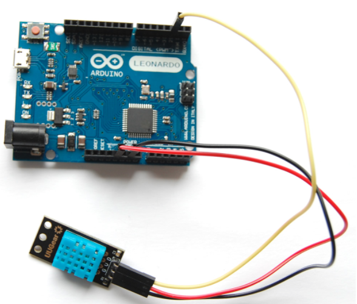

# 3.5 Temperatura y humedad

## Control de temperatura y humedad

Vamos a utilizar dos sensores para medir estas variables: \# **DHT12** y su hermano pequeño **DHT11**. Aunque lo vamos a contar brevemente, te recomendamos [esta página](https://www.luisllamas.es/arduino-dht11-dht22/) para saber más de estos dos sensores.

## 

