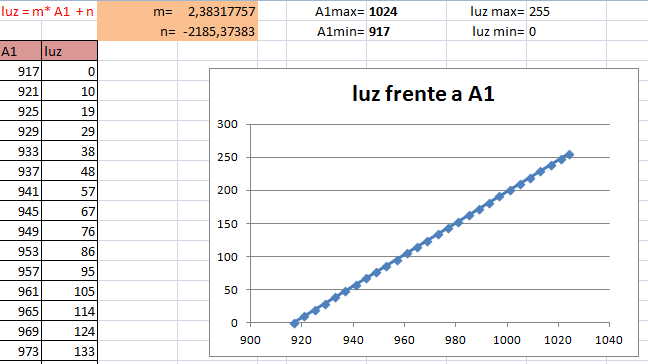

# 3.1.2 Mapeo de valores

En ocasiones, los valores que obtenemos de una lectura de un pin, como un sensor, pueden estar fuera de una escala determinada, y tenemos que convertirlos a otro rango para poder usarlos.

Por ejemplo:

Supongamos que hacemos una lectura previa de lo que nos devuelve **el LDR** y nos devuelve unos valores mínimo y máximo por ejemplo: _**917, 1024**_ y queremos traducir estos valores al rango **0-255** pues es lo que podemos darle a un LED. La solución será \_mapear \_esos valores para que, en caso de obtener el valor 917 \(el equivalente a oscuridad\), el led verde se apague \(0\) y la máxima luminosidad \(1024\) el led se ilumine al máximo \(255\).

La función “**map**” del programa asigna un valor máximo y un valor mínimo a un rango dado.

\_Nota: En el próximo montaje el valor máximo suele estar en 1024, pero el mínimo dependerá de las condiciones de luz en las que realicemos la práctica. Por eso en el código se especifican 2 variables que deberemos colocar a mano:

_**bajo\_LDR**_ y _**alto\_LDR**_.\_

_Observa si tu montaje necesita de algún ajuste utilizando la función map._

[_Aquí tienes un Excel_](http://aularagon.catedu.es/materialesaularagon2013/Arduino-codigo/3_Electronica_analogica/calculo_map.xlsx) _\(xlsx - 12,88 KB\) para ver la transformación lineal que hace map con los valores que hemos comentado, es simplemente una demostración de lo que hace internamente la función **map**_

