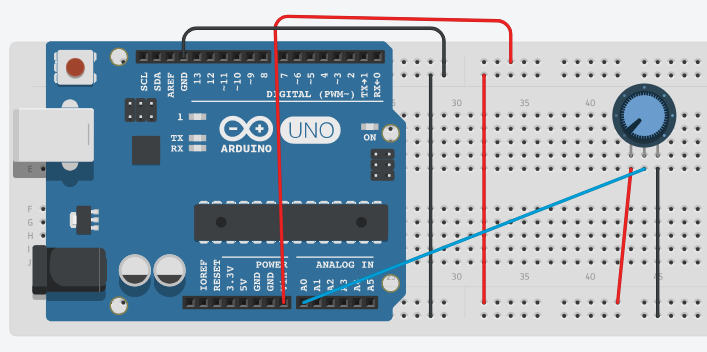

# 3.1.1 M2: Mapeo

Vamos LEER LOS VALORES DEL POTENCIÓMETRO EN PANTALLA

## SIN EDUBÁSICA

Conectamos la salida de un potenciómetro a A0



## CON EDUBASICA

No hay que hacer nada, ya está !

## Continuamos ...

Fíjate como **dividimos los valores** del potenciómetro A0 \(que va desde 0 a 1024\) **entre 204.6** para convertirlos dentro del rango de 0-5V \( 1024/5=204.6 \) :

```text
float val = 0;

void setup(){
Serial.begin(9600);
}
void loop(){
val = analogRead(A0); 
//leemos el potenciómetro (0-1024)
val = val/204,6; 
//mapeamos los valores para que sean de 0 a 5V
Serial.print (val); 
//vemos por pantalla el valor en Voltios
Serial.println("V");
delay(1000);
}
```

Este es el vídeo:

