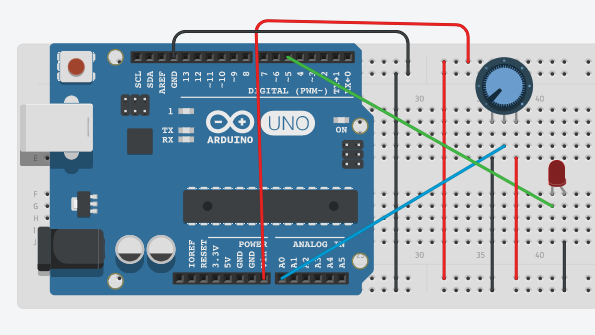

# 3.3 M4 Intensidad LED

Se trata de obtener el mismo efecto que se consiguió en [la práctica correspondiente al potenciómetro](https://github.com/deleyva/programa-arduino-mediante-codigo/tree/a407da71017a2f6edc4a9de5f70319276906de88/montaje_4_mapeo_potenciometro_edubasica.html), las instrucciones principales eran:

```text
void loop() {
  val = analogRead(0);  // val tiene el rango 0-1024
  analogWrite(3, val/4); //dividimos por 4 para entrar en el rango 0-255
}
```

Pero en este caso utilizaremos **el mapeo**.

La descripción de la práctica es la siguiente:

La regulación del potenciómetro provocará una variación de voltaje en el pin de entrada analógico 0 de Arduino. Se realizará una conversión analógica-digital en el que los valores de tensión analógicos entre 0 y 5 V se transforma a un rango discreto de valores de 0 a 1023. Para modificar la intensidad del led rojo le se enviará una señal pseudoanalógica PWM utilizando la salida 5 digital de Arduino. Para ello se enviará un valor de 0 a 255 que marcará el ciclo de trabajo de la onda cuadrada PWM. Previamente habrá que realizar un mapeo \(instrucción map\) para asignar valores desde el intervalo \[0, 1023\] al \[0, 255\].

## SIN EDUBASICA

Tienes que conectar un led al D5 y un potenciómetro al A0



## CON EDUBÁSICA

No tienes que conectar nada ;\) ya está !

## Continuamos

Este es el **PROGRAMA:**

```text
/* Regular la luminosidad del LED rojo  con el potenciómetro de Edubásica
Conexiones:
Pin 5 digital Arduino   -> LED rojo Edubásica
Pin 0 analógico Arduino -> Potenciómetro Edubásica
*/

int ledPin = 5;
int potenPin = A0;
int intensity, valor_poten;

void setup() {
pinMode(ledPin, OUTPUT);
Serial.begin(9600);
}

void loop() {
valor_poten=analogRead(potenPin);
intensity = map(valor_poten, 0, 1024, 0, 255);
analogWrite(ledPin,intensity); 
//Envia una onda PWM especificado en la varible: intensity.
// Observamos la lectura analogica para comprobar el fondo de escala (0 -> 1024)

Serial.print("valor analógico leído=");
Serial.println(analogRead(potenPin));
delay (1000);
}
```

