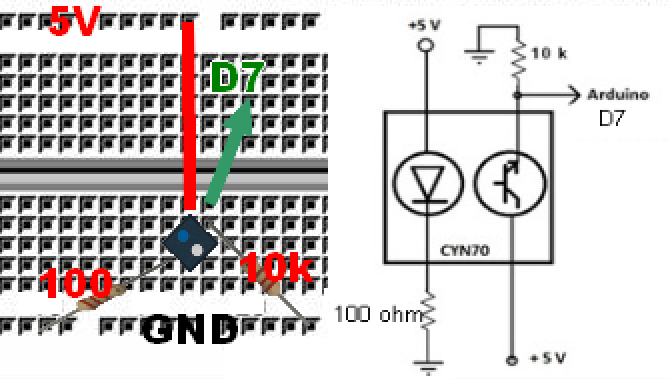

# 3.6.1 M13 detección linea blanca

El problema del CNY70 es que tiene los pines muy juntos que no se puede poner enmedio de la placa protoboard, tenemos pues que utlizar dos opciones:

* Utilizar cables Dupond macho-hembra
* Ponerlo inclinado aprovechando que dos extremos de la diagonal tienen que estar conectados a 5V

Lo mejor es utilizar cables M-H pero si no se tienen, vamos a utilizar la segunda opción, este es el esquema:



Utilizaremos la Edubásica el led rojo, si no tienes, simplemente añade un led al pin 13 [tal y como hicimos en Montaje 1 led parpadeante sin edubásica](../../2.-montajes-basicos-con-arduino/conexiones_digitales/montaje_1_led_parpadeante.md)

El programa a cargar en el Arduino es:

El resultado es:

```cpp
/*
Talos Electronics
8-Noviembre-2015
Rafael lozano Rolón 
*/
//Declaracion de variables
int sensor = 7;       //ENTRA DIGITAL FACILMENTE ACCESIBLEE EN EDUBASICA
int Valor_cny70 = 0;
int Led=5;//LED ROJO DE EDUBÁSICA
// cambialo al 13 si no utilizas EDUBÁSICA

void setup() 
{
  Serial.begin(9600);       
  pinMode(sensor, INPUT);  
  pinMode(Led, OUTPUT);   
  digitalWrite(Led, LOW);  
}

void loop() 
{
  Valor_cny70=digitalRead(sensor);
  delay(100);//Esperar 100 ms 
  if(Valor_cny70==0)
  {
    Serial.print("Linea negra\n");
    digitalWrite(Led, HIGH);
  }
  else//Si el valor del sensro es 1
  {
    Serial.print("Linea blanca\n");
    digitalWrite(Led, LOW);
  }
}
```

Y en el monitor serie sale:

  
Linea negra  
Linea negra  
Linea negra  
Linea blanca  
Linea blanca  
Linea blanca  
Linea blanca  
Linea blanca  
Linea negra  
Linea negra  
Linea negra  
Linea ...

