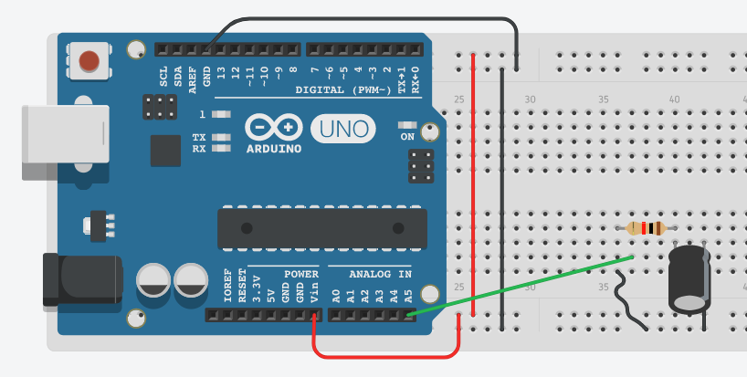
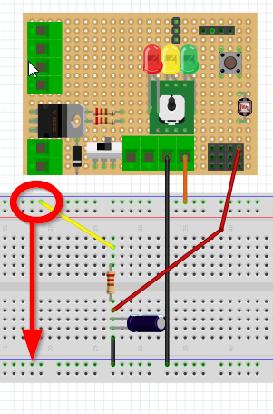

# EA.4.2 M5: Descarga

Si has hecho [el montaje anterior](https://github.com/deleyva/programa-arduino-mediante-codigo/tree/a407da71017a2f6edc4a9de5f70319276906de88/montaje_8_carga_de_un_condensador.html), terminarás con el condensador **totalmente cargado**, procede con el mismo programa que va leyendo A5 a desconectar el cable amarillo de 5V y conectarlo a GND entonces el condensador se irá descargando a masa.

## SIN EDUBASICA

## CON EDUBÁSICA

## Continuamos ...

Por el monitor serie se van leyendo los valores, puedes copiarlos y pegarlos en la misma hoja excell y verás la gráfica de descarga del condensador, que con el misma fórmula T=5RC nos sale aproximadamente 5 segundos de prácticamente el tiempo de descarga:

