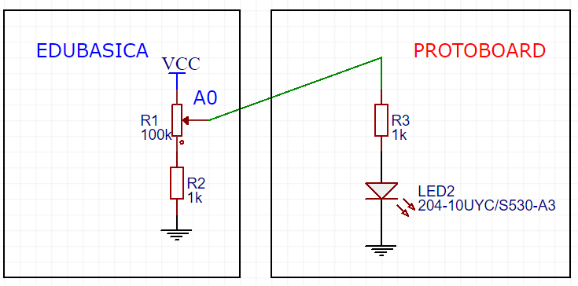
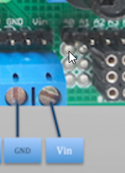
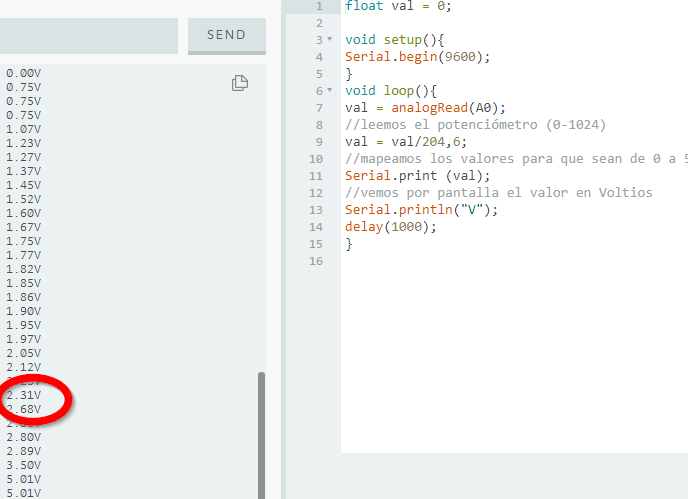
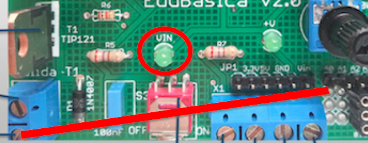
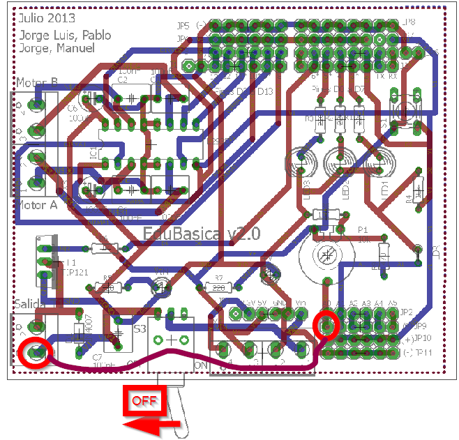
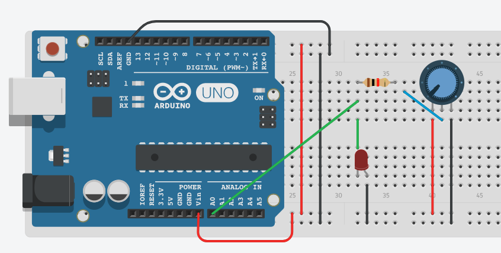

# EA 3.1 Diodos M3 Estudio tensión umbral

Objetivo: Medir la tensión del diodo con Arduino con una entrada analógica, A0 \(por ejemplo\) para detectar la tensión umbral. El diodo lo alimentaremos con un potenciómetro para ir subiendo los valores

## CON EDUBÁSICA

Vamos a realizar el siguiente esquema:



Para conectar un cable con A0 tenemos que localizar el orificio \(señalado en esta imagen\) y para la masa utilizamos el segundo tornillo



Montamos:

!\[\]\(img/2017-09-08_123740-TRANSISTOR-CORTE-SAT.fzz-\_Fritzing_-_\[Vista\_de\_Protoboard_\(placa\_de\_Prototipos.png\)

Carga este código en tu placa Arduino:

```text
float val = 0;

void setup(){
    Serial.begin(9600);
}
void loop(){
    val = analogRead(A0);  //leemos el potenciómetro (0-1024)
    val = val/204,6; //mapeamos los valores para que sean de 0 a 5V
    Serial.print (val);  
    Serial.print ("V"); //vemos por pantalla el valor en Voltios
    Serial.println();
    delay(1000);
}
```

Abre el Monitor serial de Arduino \(ctrl+may+M\) y verás el voltaje que está ofreciendo Arduino al montaje que has hecho.

Mueve el potenciómetro y verás que el valor va cambiando. Intenta averiguar cual es la tensión umbral a partir de la cual tu led empieza a emitir luz.

Nota: inicialmente la corriente puede ser muy baja por lo que debes fijarte bien cuando empieza a iluminarse.

Verás que alrededor **de 2.5V** el led empieza a iluminarse



**TRUCO**

Se puede hacer **sin ningún circuito exterior**, utilizando la resistencia R5 y **el diodo de VIN**, para ello bastaría:

* Desconectar el interruptor que une V1 con Vin
* Unir con un cable V1 con A0

 

Poner interruptor en OFF y unir el cable uniendo V1 con A0 \(dibujado en morado\) :



## SIN EDUBASICA

Igual, simplemente que tienes que hacer el circuito del potenciómetro exteriormente



