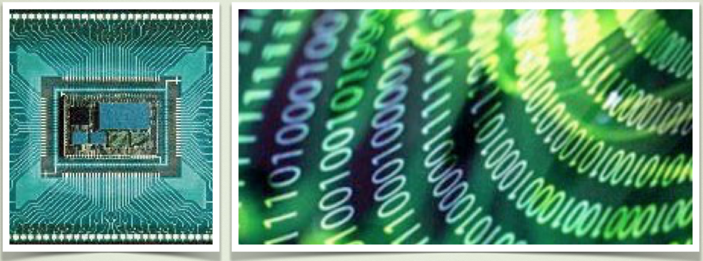

# ED.0 Electrónica digital

## Electrónica digital

Entendemos por electrónica digital, la que se encarga de sistemas electrónicos en los que sólo existen 2 valores o estados: verdadero/falso, "0" ó "1".

En este capítulo trabajaremos los conceptos principales del Álgebra de Boole y de las puertas lógicas que utilizaremos para diseñar circuitos. Utilizaremos Arduino y la placa EduBásica.

## Conocimiento previo

* Programación básica de Arduino.

## Objetivos

* Conocer las propiedades del Álgebra de Boole.
* Operar con variables binarias.

Lista de materiales:

* Placa Arduino.

