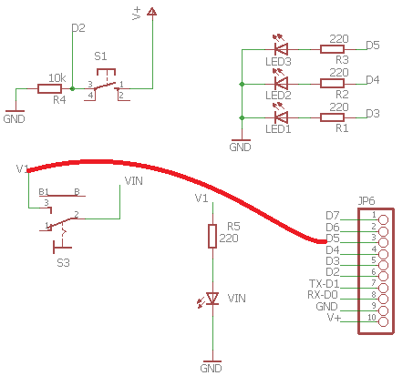
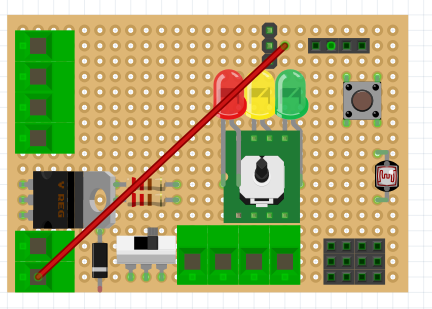
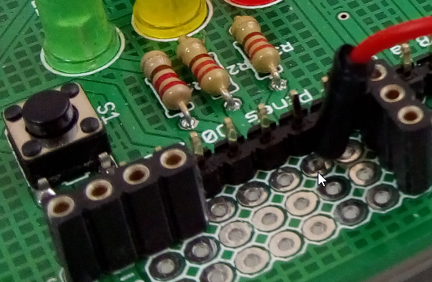

# ED.3 M11 AND con EDUBASICA

En este caso, para ahorrar cableado, vamos a utilizar:

* Como variable 1 de entrada el pin D2 que ya tiene el **pulsador**, y lo visualizaremos en el pin D4 que tiene el **LED VERDE**.
* Como variable 2 de entrada el pin D5 que lo conectaremos con un cable a V1 que tiene el **interruptor** y ya se visualiza en el **LED AMARILLO**.
* Como variable de salida el pin D3 que es el **LED ROJO**.

El esquema sería el siguiente:



Y el esquema de conexiones es muy fácil, conectar V1 con el agujero D5 de JP6:



Aquí teneis el detalle de dónde está el agujero D5



El código sería:

```cpp
/*
  Boole
  Función AND con 2 variables
 */
//////////////////// entradas ///////////////////////////////////////////////////////////////////////////
int var1 = 2;       //Pin D2 de entrada del pulsador 1
int var2 = 5;       //Pin D5 de entrada del pulsador 1 y led(rojo), conectamos V1 con D5 con un cable
int ledvar1 = 4;    //Pin D4 de salida para el var1 led(amarillo)
//////////////////// salidas /////////////////////////////////////////////////////////////////////////
int ledsalida = 3;    //Pin de salida para el led(verde)
////////////////////////////////////////////////////////////////////////////////////////////////////
int estado1 = 0;    //Para almacenar el estado de la variable1
int estado2 = 0;    //Para almacenar el estado de la variable2
int resultado = 0;  //Para almacenar el resultado      

void setup() {
  pinMode(var1, INPUT);         //Iniciliza el pin de entrada 1 como salida
  pinMode(var2, INPUT);         //Iniciliza el pin de entrada 2 como salida  
  pinMode(ledvar1, OUTPUT);     //Inicialliza led de var1 como salida
  ///////////////////////////////// no hace falta inicializar D5 como salida, pues estará con un cable visualizando V1
  pinMode(ledsalida, OUTPUT);     //Iniciliza el pin del led como salida 
}

void loop(){
  estado1 = digitalRead(var1);      //Lee el estado del botón y lo almacena
  digitalWrite(ledvar1, estado1);   //Se visualiza en el led amarillo la entrada var1
  estado2 = digitalRead(var2);      //Lee el estado del botón y lo almacena

  resultado = (estado1 && estado2); //Función AND con los dos estados
  digitalWrite(ledsalida, resultado);    //Escribimos el resultado en el led
}
```

Y el resultado es :

