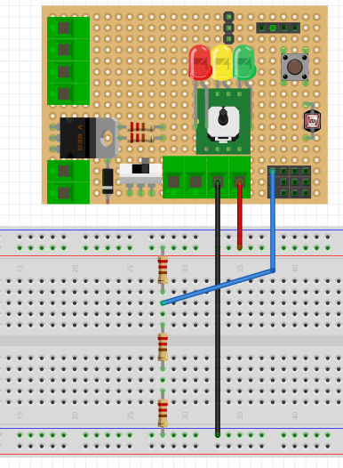
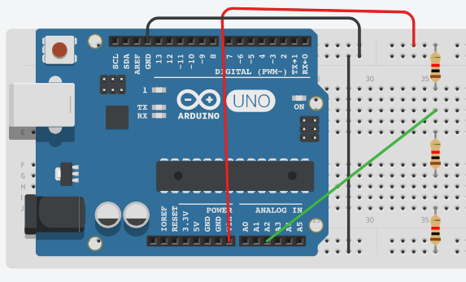

# EA.2.2 M1: serie

## Montaje 1: Resistencias en serie

Elige cuatro resistencias de cualquier valor para los montajes en serie pero procura que sean de valores muy distintos. Para ello utiliza[ la tabla con los códigos de colores ](https://es.wikipedia.org/wiki/Resistor)o bien mide los valores directamente con un polímetro \(medida de ohmios\).

### Con EDUBÁSICA

Monta el siguiente circuito divisor de tensión:



El cable rojo es la Vin \(5V\) y el negro GND. El cable azul es la salida Vout que la lee A2 por eso está conectado al A2 de EDUBASICA

Usa la protoboard para intercalar, entre los extremos del cable azul y negro, las resistencias que elegiste y prueba distintas combinaciones en serie quitando y poniendo resistencias. Debes observar que la luminosidad del led varía.

### SIN EDUBÁSICA

Igual, simplemente que A2, Vin y GND lo tienes en el mismo ARDUINO



### Continuamos...

El programa que hay que ejecutar en el arduino es este

```text
//Conectaremos resistencias en serie entre Vout=A2 y GND

void setup() {                 
  // Pin 3 tiene el LED verde
  pinMode(3, OUTPUT);       
}
void loop() {
  analogWrite(3,analogRead(2)/4);
//Dividimos el valor entre 4 para adecuar la salida a 255
}
```

## Reflexión

¿Cómo afecta el valor de las resistencias en serie en la luminosidad del LED?

%accordion%Solución%accordion%

Según la fórmula del divisor de tensión CUANTO MÁS RESISTENCIA HAYA ABAJO \(R2 en la fórmula\) MÁS TENSIÓN HAY por lo tanto más se ilumina el led que visualiza lo que entra por A2\).

%/accordion%

