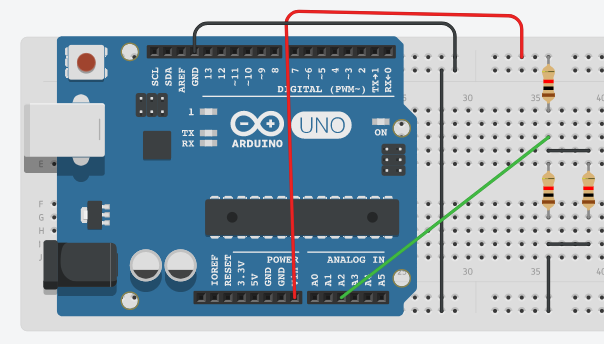

# EA.2.3 M2: paralelo.

Este ejercicio es similar al anterior, puedes usar las mismas resistencias y el mismo programa.

Une ahora uno de los extremos de las resistencias conectadas en paralelo al pin 2 analógico y el otro extremo a GND. Prueba a quitar alguna de las resistencias y obtén conclusiones de lo que ocurre.

## CON EDUBASICA

## SIN EDUBASICA

