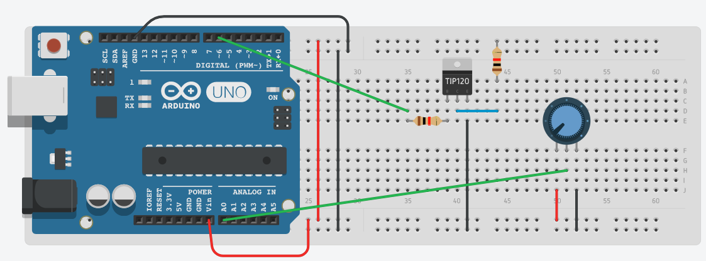
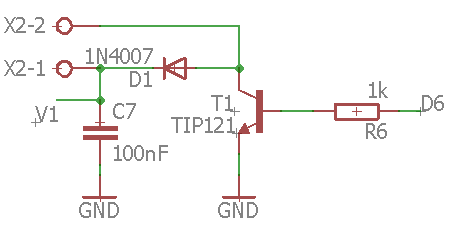

# EA.5.3 M7:  activo

En esta práctica el transistor va a actuar como amplificador de corriente, dentro de la zona activa para ello se va a realizar el siguiente montaje:

## SIN EDUBASICA

Ponemos una resistencia en el colector y un potenciómetro en A0:



## CON EDUBASICA


## Continuamos...

El funcionamiento de este circuito es el siguiente: a partir de potenciómetro que tenemos en la placa EduBásica controlamos la salida PWM del pin D6 variando la tensión aplicada a la resistencia de base Rb que en Edubásica es R6:



Y sin edubásica mediremos en la resistencia conectada en la base.

Utilizaremos el siguiente código:

```text
int ledPin = 6;
int potenPin = A0;
int intensity, valor_poten;
int n;

void setup() {
pinMode(ledPin, OUTPUT);
Serial.begin(9600);
n=1;
}

void loop() {
    valor_poten=analogRead(potenPin);
    intensity = map(valor_poten, 0, 1024, 0, 255);
    analogWrite(ledPin,intensity); 
    Serial.print("valor analógico leído=");
    Serial.println(analogRead(valor_poten));
    delay (1000);
}
```

El resultado es que podemos tener el transistor dentro de la zona activa manejando el potenciómetro, en el siguiente vídeo se muestra el polímetro que mide la tensión del colector y como varía de **corte** \(casi 5V\) a **saturación** \(casi 0V\) pasando por la zona **activa**:

